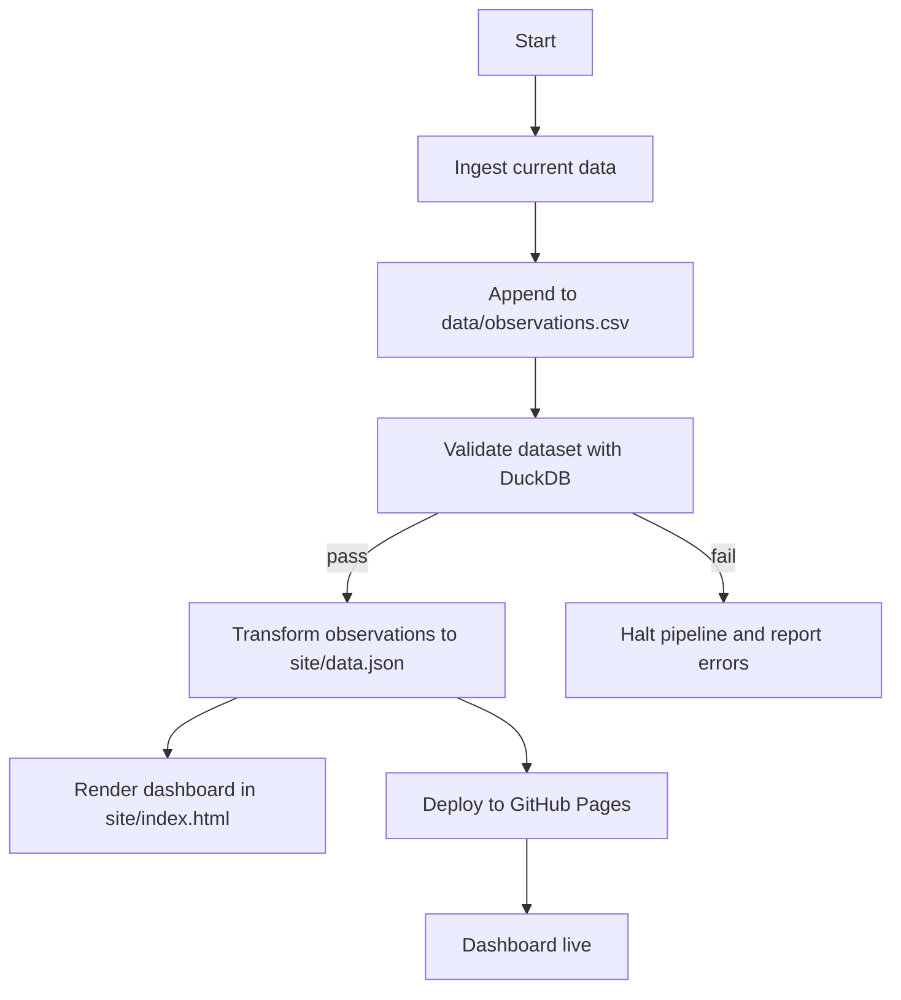

[](https://github.com/tinkugoel/live-weather-data-feed-website/actions/workflows/pipeline.yml)   &emsp;    [](https://github.com/tinkugoel/live-weather-data-feed-website/actions/workflows/ci.yml)
# Live Weather Data Feed Pipeline

A lightweight weather and air-quality data pipeline that ingests, validates, transforms, and publishes time-series observations using Python, DuckDB, and GitHub Pages.

Website URL: [Live Weather & Air Quality Pipeline](https://tinkugoel.github.io/live-weather-data-feed-website/)

## About this project

This repository captures a complete end-to-end data pipeline for tracking air quality and weather in selected cities. The pipeline is designed to be transparent, versioned, and reproducible by storing raw observations in CSV and publishing a static dashboard from generated JSON.

Key characteristics:
- Ingests current weather and air-quality data from Open-Meteo APIs
- Stores observational history in `data/observations.csv`
- Validates data quality before building derived outputs
- Uses DuckDB for transformation and aggregation
- Publishes a static dashboard through GitHub Pages
- Operates on India Standard Time (`timestamp_ist`)

## Architecture

### 1. Ingestion

`src/ingest.py` is responsible for fetching current readings for configured cities. It collects:
- temperature
- humidity
- wind speed
- precipitation
- PM2.5
- PM10
- US AQI

The results are appended to `data/observations.csv` with the following schema:
- `timestamp_ist`
- `city`
- `temperature_c`
- `humidity_pct`
- `wind_speed_kmh`
- `precipitation_mm`
- `pm2_5`
- `pm10`
- `us_aqi`

### 2. Validation

`src/validate.py` enforces data-quality rules using DuckDB. It checks for:
- missing `timestamp_ist` or `city`
- temperature values outside `-60..60 °C`
- humidity outside `0..100 %`
- negative particulate readings
- duplicate `(timestamp_ist, city)` rows

If any validation rule fails, the pipeline stops before publishing.

### 3. Transformation

`src/transform.py` reads `data/observations.csv` and builds a JSON payload for the dashboard at `site/data.json`.

It produces:
- `stats` (`total_observations`, `cities`, `collecting_since`)
- `latest` latest observation per city
- `series` recent time series rows for charting
- `daily` aggregated daily statistics per city

### 4. Dashboard

`site/index.html` renders the pipeline output using Chart.js and client-side JavaScript.

The dashboard displays:
- city cards with current conditions and AQI
- a temperature trend line chart
- an AQI trend line chart
- generated timestamp using `generated_at_ist`

### 5. Automation and deployment

Two GitHub Actions workflows are included:

- `.github/workflows/ci.yml`
  - installs dependencies
  - runs `ruff` linting
  - runs `pytest`

- `.github/workflows/pipeline.yml`
  - runs every 2 hours
  - ingests fresh observations
  - validates the raw data
  - transforms the dataset to JSON
  - commits new data back to the repository
  - deploys the dashboard to GitHub Pages

## Pipeline flow



## Getting started

### Requirements

- Python 3.12+
- `pip`

Install dependencies:

```bash
pip install -r requirements.txt
```

### Run locally

Ingest fresh observations:

```bash
python src/ingest.py
```

Validate the dataset:

```bash
python src/validate.py
```

Build dashboard data:

```bash
python src/transform.py
```

Run tests:

```bash
pytest -v
```

## Repository structure

- `src/ingest.py` — ingest current weather and air quality data
- `src/validate.py` — data-quality checks
- `src/transform.py` — build dashboard JSON with DuckDB
- `data/observations.csv` — raw time-series dataset
- `site/index.html` — static dashboard UI
- `site/data.json` — generated dashboard payload
- `.github/workflows/ci.yml` — continuous integration
- `.github/workflows/pipeline.yml` — scheduled ETL and deployment

## Design goals

- simplicity: minimal dependencies and self-contained pipeline
- auditability: every observation is stored in Git history
- reproducibility: transformations are defined in SQL and Python
- transparency: static dashboard source is fully visible in the repo
